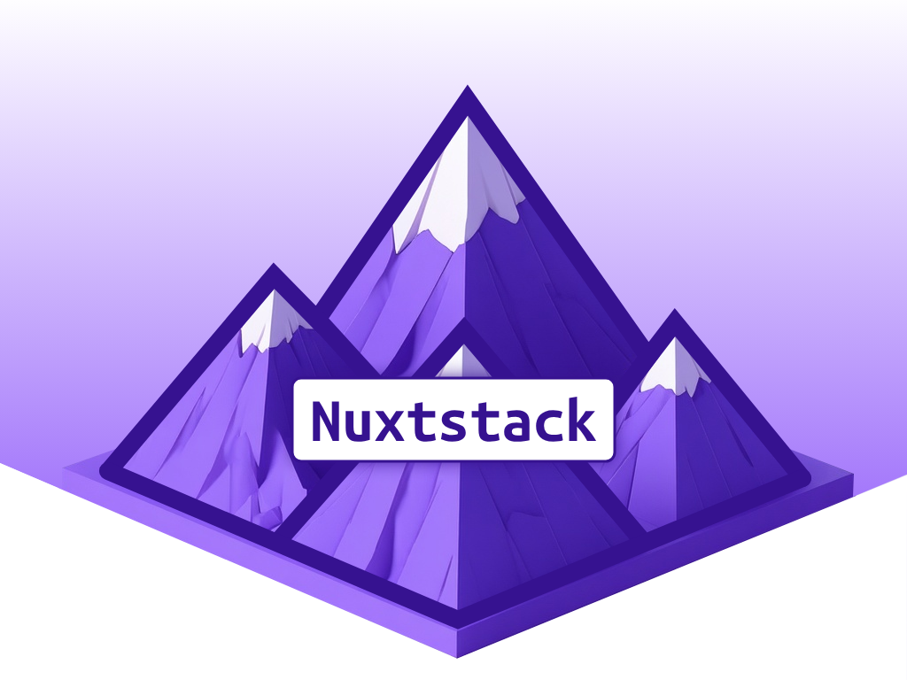

# Nuxtstack



Similar to [MKStack](https://getstacks.dev/stack/naddr1qvzqqqrhl5pzqprpljlvcnpnw3pejvkkhrc3y6wvmd7vjuad0fg2ud3dky66gaxaqqrk66mnw3skx6c4g6ltw), but build upon [Nuxt](https://nuxt.com/) with [Vue](https://vuejs.org/) and Javascript only (so no React and no Typescript).

**Nuxstack provides a Rapid Application Building (RAD) development framework using an AI agent like Goose or Claude Desktop.**

This is a development boilerplate/starter template specifically designed for rapid prototyping and AI-assisted development workflows. The goal is to build (Nostr) apps and websites in minutes.

## How to start

1. Clone this repository `git clone https://gitlab.com/sebastix-group/nostr/nuxtstack.git`
2. Install all depencies `npm install`
3. Start the development server from your CLI in the cloned directory `npm run dev` and the application will be accessible via the browser (follow the instructions on your terminal)
4. Start your AI agent application (Goose) and point it to the cloned directory
5. Start prompting, let the AI agent make changes
6. Optionally, choose a template from https://nuxt.com/templates and tell the AI agent to use this template to apply.
7. When the template is active, start prompting to make changes and build the application you have in mind.

## 🛠️ Technology Stack

- **Nuxt**: Progressive Vue.js framework for web applications
- **Vue.js**: Frontend framework with custom element support enabled
- **TailwindCSS**: Utility-first CSS framework with Vite plugin
- **Pinia**: State management for Vue applications
- **Vite**: Build tool and development server
- **JavaScript**: Pure JS implementation (no TypeScript)
- **GSAP**: high class JavaScript animation library
- **Shaders**: library for building creative WebGPU effects in components

## 🚀 Purpose & Target

- **Nostr Application Development**: Build decentralized social applications on the Nostr protocol
- **AI-Assisted Development**: Extensive tooling for AI agents and automated development workflows
- **Rapid Prototyping**: Accelerate Nostr app development with pre-configured tooling

## 📋 Current State

This is a **fresh starter template** with:
- Basic application structure (`App.vue`)
- Footer component template
- Empty directories ready for:
  - Pages (used for routing)
  - Layouts
  - Components
  - Nostr web components inside the Components directory
- Complete build and development pipeline

## 🔧 MCP (Model Context Protocol) Integration

The project includes three configured MCP servers for enhanced AI development:
- **js-dev**: JavaScript development tools
- **nostr**: Nostr protocol specific tools  
- **nuxt**: Nuxt framework specific tools

## ✨ Key Features

1. **Development-Ready**: Complete build pipeline (dev, build, generate, preview)
2. **Nostr-Focused**: Dedicated tooling and components structure for Nostr development
3. **AI-Agent Friendly**: Extensive configuration for automated development workflows
4. **Modern Stack**: Latest versions of Nuxt, TailwindCSS, and supporting tools

## 🚀 Quick Start

```bash
# Install dependencies
npm install

# Start development server
npm run dev

# Build for production
npm run build

# Generate static site
npm run generate

# Preview production build
npm run preview
```

## 🏗️ Project Structure

```
nuxtstack/
├── components/           # Vue components
│   ├── nostr-web-components/  # Nostr-specific components
│   └── Footer.vue       # Example component
├── layouts/             # Nuxt layouts (empty - ready for your layouts)
├── pages/               # File-based routing (empty - ready for your pages)
├── assets/              # Static assets and styles
├── public/             # Static files served directly
├── stores/             # # Pinia stores for state management
├── .mcp.json           # MCP server configuration for AI tools
├── nuxt.config.js      # Nuxt configuration
└── App.vue             # Root application component
```

## 🎯 What You Can Build

This framework is perfect for building:
- Decentralized social media clients
- Nostr-based marketplaces
- Messaging applications
- Content publishing platforms
- Community forums
- Any application leveraging the Nostr protocol

## 📚 Resources

- [Nuxt Documentation](https://nuxt.com/)
- [Nostr Protocol](https://nostr.com/)
- [TailwindCSS Documentation](https://tailwindcss.com/)
- [Vue.js Documentation](https://vuejs.org/)

## 📄 License

GNU GENERAL PUBLIC LICENSE v3
---

**Ready to build the decentralized web?** Start developing your Nostr application with this modern, AI-friendly framework.
